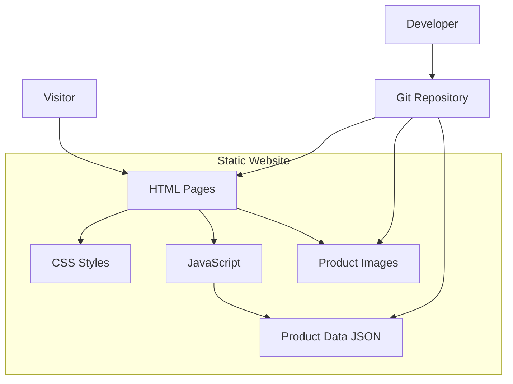

# Design Document: Static Bag Ecommerce Website

## Overview

The JF Collections static bag ecommerce website is a purely static, content-focused web application that displays product catalogs, detailed product information, and provides contact functionality for purchase inquiries. The system is a single-page application with no backend, designed for free hosting on platforms like GitHub Pages, Netlify, or Vercel.

### Key Design Decisions

1. **Pure Static Site**: The entire website is built as static HTML, CSS, and JavaScript files with no backend server or database. All product data is stored in a single JSON file that is loaded client-side.

2. **File-Based Content Storage**: Product data and images are stored in a structured file system (JSON for data, organized directories for images). Content updates are made by directly editing the products.json file and redeploying the site.

3. **Client-Side Everything**: All functionality including filtering, search, and product display is implemented client-side using JavaScript, making the site completely self-contained.

4. **Responsive-First Design**: The layout is built mobile-first using CSS Grid and Flexbox, with breakpoints at 768px (tablet) and 1024px (desktop).

5. **Progressive Enhancement**: Core content is accessible without JavaScript, with enhanced features (filtering, search, image galleries) layered on top.

### Technology Stack

- **Frontend**: HTML5, CSS3 (with CSS Grid/Flexbox), Vanilla JavaScript
- **Data Storage**: Static JSON file (products.json)
- **Deployment**: Static file hosting (GitHub Pages, Netlify, Vercel, or any CDN)
- **Content Management**: Direct file editing and git-based deployment

## Architecture

### System Components



### Component Interactions

1. **Visitor Flow**: Visitors access static HTML pages that load product data from the products.json file and display images from the images directory. Client-side JavaScript handles all filtering, search, and interactive features.

2. **Content Management Flow**: Developers or content managers update product information by directly editing the products.json file and adding/removing image files. Changes are committed to the git repository and deployed through the hosting platform's automatic deployment pipeline.

3. **Deployment Flow**: When changes are pushed to the repository, the hosting platform (GitHub Pages, Netlify, Vercel) automatically deploys the updated static files, making them immediately available to visitors.

### Directory Structure

```
/
├── index.html              # Product catalog page
├── product/                # Individual product pages
│   └── [id].html
├── about.html
├── contact.html
├── css/
│   └── styles.css
├── js/
│   ├── catalog.js          # Filtering and search
│   ├── product.js          # Product page interactions
│   └── navigation.js       # Menu and navigation
├── data/
│   └── products.json       # Product catalog data
└── images/
    └── products/           # Product images
        └── [id]/
```

## Components and Interfaces

### Frontend Components

#### 1. Product Catalog Component

**Responsibility**: Display all products in a grid layout with filtering and search capabilities.

**Interface**:
```javascript
class ProductCatalog {
  constructor(products, containerElement)
  render()
  applyFilters(filters)
  search(query)
  clearFilters()
}
```

**Key Features**:
- Responsive grid layout (CSS Grid)
- Client-side filtering by category and price range
- Real-time search with term highlighting
- Lazy loading for images below the fold

#### 2. Product Card Component

**Responsibility**: Display summary information for a single product.

**Interface**:
```javascript
class ProductCard {
  constructor(product)
  render()
  getElement()
}
```

**Data Structure**:
```javascript
{
  id: string,
  name: string,
  briefDescription: string,
  price: number,
  primaryImage: string,
  category: string
}
```

#### 3. Product Page Component

**Responsibility**: Display detailed product information with image gallery.

**Interface**:
```javascript
class ProductPage {
  constructor(product)
  renderDetails()
  renderImageGallery()
  initializeGallery()
}
```

**Data Structure**:
```javascript
{
  id: string,
  name: string,
  briefDescription: string,
  fullDescription: string,
  price: number,
  dimensions: { inches: string, centimeters: string },
  materials: string[],
  colors: string[],
  images: string[],
  careInstructions: string | null,
  category: string
}
```

#### 4. Navigation Component

**Responsibility**: Provide site navigation with responsive menu.

**Interface**:
```javascript
class Navigation {
  constructor(containerElement)
  render()
  setActive(section)
  toggleMobileMenu()
}
```

#### 5. Filter Component

**Responsibility**: Manage product filtering UI and state.

**Interface**:
```javascript
class FilterComponent {
  constructor(onFilterChange)
  render()
  getActiveFilters()
  reset()
}
```

**Filter State**:
```javascript
{
  categories: string[],
  priceRanges: string[]
}
```

#### 6. Search Component

**Responsibility**: Handle product search functionality.

**Interface**:
```javascript
class SearchComponent {
  constructor(products, onSearch)
  search(query)
  highlightTerms(text, query)
}
```

#### 7. Contact Form Component

**Responsibility**: Validate and handle contact form submissions.

**Interface**:
```javascript
class ContactForm {
  constructor(formElement)
  validate()
  prefillSubject(productName)
  submit()
}
```

## Data Models

### Product Model

```javascript
{
  id: string,                    // UUID
  name: string,                  // 1-100 characters
  briefDescription: string,      // 1-200 characters
  fullDescription: string,       // Rich text HTML
  price: number,                 // Positive decimal
  dimensions: {
    inches: string,              // e.g., "12 x 8 x 4"
    centimeters: string          // e.g., "30 x 20 x 10"
  },
  materials: string[],           // e.g., ["Leather", "Cotton"]
  colors: string[],              // e.g., ["Black", "Brown"]
  images: string[],              // Array of image filenames
  careInstructions: string | null,
  category: string,              // "backpack" | "handbag" | "tote" | "travel"
  createdAt: string,             // ISO 8601 timestamp
  updatedAt: string              // ISO 8601 timestamp
}
```

### Filter State Model

```javascript
{
  categories: string[],          // Selected categories
  priceRanges: string[]          // Selected price ranges
}
```

### Contact Form Model

```javascript
{
  name: string,                  // 1-100 characters
  email: string,                 // Valid email format
  subject: string,               // 1-200 characters
  message: string,               // 1-2000 characters
  timestamp: string              // ISO 8601 timestamp
}
```

### Products JSON Structure

The main data file that powers the static site:

```javascript
{
  products: Product[],
  categories: {
    backpack: number,            // Count of products
    handbag: number,
    tote: number,
    travel: number
  },
  lastUpdated: string            // ISO 8601 timestamp
}
```


## Correctness Properties

*A property is a characteristic or behavior that should hold true across all valid executions of a system—essentially, a formal statement about what the system should do. Properties serve as the bridge between human-readable specifications and machine-verifiable correctness guarantees.*

### Property 1: Complete Product Catalog Display

*For any* product catalog, when rendered on the main page, all products from the catalog should appear in the output with each product displaying its name, primary image, price, and brief description.

**Validates: Requirements 1.1, 1.2**

### Property 2: Product Card Navigation

*For any* product card, clicking on it should trigger navigation to the URL corresponding to that product's detail page.

**Validates: Requirements 1.3**

### Property 3: Complete Product Detail Display

*For any* product, when its detail page is rendered, the output should contain the product name, full description, price, dimensions (in both inches and centimeters), all materials, all available colors, all images (minimum 3), and care instructions if present.

**Validates: Requirements 2.1, 2.2, 10.1, 10.2, 10.3, 10.4, 10.5**

### Property 4: Image Gallery Interaction

*For any* product with multiple images, clicking on any thumbnail image should display the corresponding full-size image.

**Validates: Requirements 2.3**

### Property 5: Combined Filter Correctness

*For any* product catalog and any combination of category and price range filters, the filtered results should contain only products that match all selected filter criteria.

**Validates: Requirements 4.2, 4.4, 4.5**

### Property 6: Filter Reset Round Trip

*For any* product catalog with active filters, clearing all filters should restore the display to show the complete original catalog.

**Validates: Requirements 4.6**

### Property 7: Universal Navigation Presence

*For any* generated page in the website, the rendered output should contain navigation menu elements.

**Validates: Requirements 5.1**

### Property 8: Email Validation

*For any* string submitted as an email in the contact form, the validation should accept strings matching valid email format (containing @ and domain) and reject strings that don't match this format.

**Validates: Requirements 6.2, 6.3**

### Property 9: Contact Form Pre-fill

*For any* product, clicking the quick contact button should pre-fill the contact form's subject field with that product's name.

**Validates: Requirements 6.5**

### Property 10: Image Lazy Loading

*For any* product catalog page, images positioned below the initial viewport should have lazy loading attributes applied.

**Validates: Requirements 7.2**

### Property 11: Image Alt Text Completeness

*For any* product with images, all rendered image elements should include alt text attributes.

**Validates: Requirements 8.1**

### Property 12: Form Accessibility

*For any* form input or button element in the website, the rendered element should include ARIA labels (aria-label or aria-labelledby attributes).

**Validates: Requirements 8.4**

### Property 13: Universal Search Presence

*For any* generated page in the website, the rendered output should contain a search input field.

**Validates: Requirements 9.1**

### Property 14: Search Result Correctness

*For any* product catalog and any search term, the search results should contain only products where the search term appears in either the product name or description (case-insensitive).

**Validates: Requirements 9.2**

### Property 15: Search Term Highlighting

*For any* search term and matching product, the rendered search result should wrap the matching text in highlight elements.

**Validates: Requirements 9.5**

## Error Handling

### Public Website Error Handling

#### 1. Product Not Found
- **Scenario**: Visitor navigates to a product page that doesn't exist
- **Handling**: Display a 404 page with a link back to the catalog
- **User Message**: "Product not found. This product may have been removed or the link may be incorrect."

#### 2. Search No Results
- **Scenario**: Search query returns no matching products
- **Handling**: Display empty state with helpful message
- **User Message**: "No products found matching '[search term]'. Try different keywords or browse all products."

#### 3. Filter No Results
- **Scenario**: Applied filters result in no matching products
- **Handling**: Display empty state with option to clear filters
- **User Message**: "No products match your selected filters. Try adjusting your filters or view all products."

#### 4. Image Load Failure
- **Scenario**: Product image fails to load
- **Handling**: Display placeholder image with alt text
- **Fallback**: Show product name and "Image unavailable" message

#### 5. Contact Form Validation Errors
- **Scenario**: User submits invalid form data
- **Handling**: Display inline error messages for each invalid field
- **Error Messages**:
  - Empty name: "Please enter your name"
  - Invalid email: "Please enter a valid email address (e.g., name@example.com)"
  - Empty subject: "Please enter a subject"
  - Empty message: "Please enter a message"

#### 6. JavaScript Disabled
- **Scenario**: Visitor has JavaScript disabled
- **Handling**: Core content remains accessible, enhanced features gracefully degrade
- **Fallback Behavior**:
  - Product catalog displays all products (no filtering/search)
  - Product pages show all images (no gallery interaction)
  - Navigation works via standard links
  - Contact form uses standard HTML5 validation

### Data Integrity Error Handling

#### 1. Corrupted Product Data
- **Scenario**: Product JSON file is malformed or corrupted
- **Handling**: Display error message to user, log error to console
- **User Message**: "Unable to load product catalog. Please try again later."
- **Recovery**: Developers should maintain version control of products.json for easy rollback

#### 2. Missing Image Files
- **Scenario**: Product references image that doesn't exist in file system
- **Handling**: Display placeholder image, log warning to console, continue rendering
- **Fallback**: Show product name and "Image unavailable" message

## Testing Strategy

### Overview

The testing strategy employs a dual approach combining unit tests for specific examples and edge cases with property-based tests for universal correctness guarantees. This ensures both concrete bug detection and comprehensive input coverage.

### Property-Based Testing

Property-based testing will be implemented using **fast-check** for JavaScript/Node.js. Each correctness property defined in this document will be implemented as a property-based test.

**Configuration**:
- Minimum 100 iterations per property test
- Each test tagged with: `Feature: static-bag-ecommerce-website, Property {number}: {property text}`
- Seed-based reproducibility for failed test cases
- Shrinking enabled to find minimal failing examples

**Test Organization**:
```
tests/
├── properties/
│   ├── catalog.properties.test.js
│   ├── product.properties.test.js
│   ├── filtering.properties.test.js
│   └── search.properties.test.js
```

**Example Property Test Structure**:
```javascript
// Feature: static-bag-ecommerce-website, Property 1: Complete Product Catalog Display
test('all products in catalog are displayed with required fields', () => {
  fc.assert(
    fc.property(
      fc.array(productArbitrary, { minLength: 1, maxLength: 50 }),
      (products) => {
        const rendered = renderCatalog(products);
        return products.every(product => 
          rendered.includes(product.name) &&
          rendered.includes(product.primaryImage) &&
          rendered.includes(product.price.toString()) &&
          rendered.includes(product.briefDescription)
        );
      }
    ),
    { numRuns: 100 }
  );
});
```

**Generators (Arbitraries)**:

The following generators will be created for property-based testing:

```javascript
// Product generator
const productArbitrary = fc.record({
  id: fc.uuid(),
  name: fc.string({ minLength: 1, maxLength: 100 }),
  briefDescription: fc.string({ minLength: 1, maxLength: 200 }),
  fullDescription: fc.string({ minLength: 10, maxLength: 2000 }),
  price: fc.float({ min: 0.01, max: 10000, noNaN: true }),
  dimensions: fc.record({
    inches: fc.string(),
    centimeters: fc.string()
  }),
  materials: fc.array(fc.string(), { minLength: 1, maxLength: 5 }),
  colors: fc.array(fc.string(), { minLength: 1, maxLength: 10 }),
  images: fc.array(fc.string(), { minLength: 3, maxLength: 10 }),
  careInstructions: fc.option(fc.string()),
  category: fc.constantFrom('backpack', 'handbag', 'tote', 'travel'),
  createdAt: fc.date().map(d => d.toISOString()),
  updatedAt: fc.date().map(d => d.toISOString())
});

// Email generator (valid and invalid)
const validEmailArbitrary = fc.emailAddress();
const invalidEmailArbitrary = fc.oneof(
  fc.string().filter(s => !s.includes('@')),
  fc.string().map(s => s + '@'),
  fc.string().map(s => '@' + s)
);

// Filter state generator
const filterStateArbitrary = fc.record({
  categories: fc.array(
    fc.constantFrom('backpack', 'handbag', 'tote', 'travel'),
    { maxLength: 4 }
  ),
  priceRanges: fc.array(
    fc.constantFrom('under-50', '50-100', '100-200', 'over-200'),
    { maxLength: 4 }
  )
});

// Search term generator
const searchTermArbitrary = fc.string({ minLength: 1, maxLength: 50 });
```

### Unit Testing

Unit tests will focus on specific examples, edge cases, and integration points. Tests will be written using **Jest** as the testing framework.

**Test Organization**:
```
tests/
├── unit/
│   ├── components/
│   │   ├── ProductCard.test.js
│   │   ├── ProductPage.test.js
│   │   ├── Navigation.test.js
│   │   ├── FilterComponent.test.js
│   │   └── SearchComponent.test.js
│   ├── utils/
│   │   └── validation.test.js
│   └── integration/
│       ├── catalog-flow.test.js
│       └── contact-flow.test.js
```

**Key Unit Test Cases**:

1. **Specific Examples** (from requirements marked as "example"):
   - Contact form has name, email, subject, message fields (6.1)
   - Navigation menu includes Home, Products, About, Contact links (5.2)
   - Navigation displays "JF Collections" brand name (5.3)

2. **Edge Cases**:
   - Empty product catalog displays appropriate message
   - Product with exactly 3 images (minimum requirement)
   - Product with maximum allowed images (10)
   - Product name at 100 character limit
   - Brief description at 200 character limit
   - Price of $0.01 (minimum valid price)
   - Empty search results
   - Empty filter results
   - Product with no care instructions (optional field)

3. **Error Conditions**:
   - Invalid email formats (missing @, missing domain, etc.)
   - Corrupted products.json file
   - Missing image files

4. **Integration Tests**:
   - Complete visitor flow: catalog → filter → product detail → contact
   - Search and filter combination
   - Product data loading from JSON

### Test Coverage Goals

- **Line Coverage**: Minimum 80%
- **Branch Coverage**: Minimum 75%
- **Function Coverage**: Minimum 85%
- **Critical Paths**: 100% coverage for data loading and validation

### Testing Tools and Libraries

- **Test Framework**: Jest
- **Property-Based Testing**: fast-check
- **Mocking**: Jest built-in mocks
- **Coverage**: Jest coverage reports
- **E2E Testing** (optional): Playwright for critical user flows

### Continuous Integration

Tests will run automatically on:
- Every commit (unit tests and property tests)
- Pull requests (full test suite + coverage report)
- Pre-deployment (full test suite + E2E tests)

**CI Pipeline**:
1. Lint code (ESLint)
2. Run unit tests
3. Run property-based tests
4. Generate coverage report
5. Run integration tests
6. (Optional) Run E2E tests for critical flows

### Test Data Management

- **Fixtures**: Sample product data for consistent unit testing
- **Factories**: Product factories for generating test data
- **Isolation**: Each test runs in isolation with fresh data

### Performance Testing

While not part of unit/property testing, performance requirements will be validated through:
- Lighthouse audits for page load times (Requirement 7.1)
- Image size verification (automated check that all images < 200KB)
- Search response time monitoring (search < 200ms)

### Accessibility Testing

Accessibility requirements will be validated through:
- Automated tools: axe-core for ARIA labels and contrast ratios
- Manual testing: Keyboard navigation verification
- Screen reader testing: Manual verification with NVDA/JAWS (sample pages)

Note: While we cannot claim full WCAG compliance through automated testing alone, we will ensure all testable accessibility criteria are validated programmatically.
